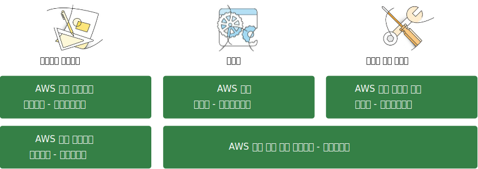

# AWS 자격증 안내서

## 왜 AWS 인증을 받나요?

AWS Certifications recognize IT professionals with the skills and knowledge to design, deploy, and operate applications and infrastructure on AWS.
Earning an AWS Certification helps you validate your technical expertise, stand out by distinguishing
your cloud skills, enhance your confidence and credibility, and contribute to your organization’s ability to create AWS solutions. 
자세한 내용은 [aws.amazon.com/certification] 에서 보세요.

## 사용 가능한 AWS 자격증

## 시험 준비

Hands-on skill and on-the-job experience are the best preparation for an AWS Certification exam.
We also highly recommend these study resources and tips.

### #1 시험 안내서 검토

AWS Certification Exam Guides outline AWS and general IT concepts covered on an exam.
It helps provide a blueprint of what you need to study and points you to resources that help you prepare.
aws.amazon.com/certification/certification-prep

#### 학습 조언 - Don’t Skip the Sample Questions

Exam sample questions help you check your knowledge and pinpoint concepts and areas requiring more study

### #2 Take an AWS Training Class

We offer a variety of education options to help you become proficient on AWS—from free instructional videos to multi-day instructor-led classes.
Classes provide the deepest technical training and the opportunity to learn directly from AWS experts and your peers.
While AWS Certification exams don’t have class prerequisites, the following classes and AWS Certification Exam Readiness Workshops can help you prepare.
[aws.training]

| AWS 자격증 시험 | AWS 교육 추천 |
|---|---|
| AWS 공인 솔루션스 아키텍트 - 어소시에이트 | • Architecting on AWS • AWS Certification Exam Readiness Workshop |
| AWS 공인 솔루션스 아키텍트 - 프로페셔널 | • Advanced Architecting on AWS • AWS Certification Exam Readiness Workshop |
| AWS 공인 개발자 - 어소시에이트 | • Developing on AWS |
| AWS 공인 시스템 운영 관리자 - 어소시에이트 | • System Operations on AWS • AWS Certification Exam Readiness Workshop |
| AWS 공인 개발 운영 엔지니어 - 프로페셔널 | • DevOps Engineering on AWS • AWS Certification Exam Readiness Workshop |

### #3 Practice with Self-Paced Labs

Self-paced online labs are a convenient way to practice AWS services and solutions in a live environment.
Delivered through our training partner qwikLABS, each lab walks you through a pre-designed scenario, providing step-by-step instructions to help you get hands-on experience with AWS and the AWS Console.
You don’t need an AWS account to take a self-paced lab.
[qwiklabs.com]

#### 학습 조언 - Try These Recommended Labs

##### 솔루션스 아키텍트-어소시에이트

* Exam Prep Quest

##### 솔루션스 아키텍트-프로페셔널

* Exam Prep Quest

##### 개발자-어소시에이트

* Introduction to AWS Identity and Access Management (IAM)
* Bundling Amazon EBS-Backed AMIs
* Working with Elastic Load Balancing
* Launching and Managing a Web Application with AWS CloudFormation

##### 시스템 운영 관리자-어소시에이트

* Working with Elastic Load Balancing
* Using Windows Server Storage Spaces with Amazon EBS
* Microsoft ADFS and AWS IAM
* Using AWS Systems Manager for Microsoft System Center Virtual Machine Manager

##### 개발 운영 엔지니어-프로페셔널

* Launching Amazon EC2 Spot Instances with Auto Scaling and Amazon CloudWatch
* Caching Static Files with Amazon CloudFront
* Deploy a Java EE Application on AWS Elastic Beanstalk Using Docker Containers
* Working with AWS Opsworks

### #4 AWS 백서 학습

AWS whitepapers written by the AWS team, independent analysts, and AWS partners can help broaden your technical understanding on topics including AWS architecture, security and economics.
[aws.amazon.com/whitepapers]

#### STUDY TIP - Review These Recommended Whitepapers

##### Associate Exam Preparation

* Architecting for the AWS Cloud: Best Practices
* AWS Security Best Practices
* Amazon Web Services: Overview of Security Processes
* Storage Options in the AWS Cloud
* Cloud Architectures
* Development and Test on AWS
* Backup and Recovery Approaches Using AWS
* Amazon Virtual Private Cloud Connectivity Options
* How AWS Pricing Works

##### Professional Exam Preparation

* Securing Data at Rest with Encryption
* Web Application Hosting in the AWS Cloud
* Migrating AWS Resources to a New Region

### #5 Review AWS FAQs

If you’re new to an AWS service, it’s a good idea to browse through our list of FAQs to familiarize yourself with commonly raised questions and issues.
aws.amazon.com/faqs

#### 학습 조언 - 이 FAQ 를 보세요

##### 어소시에이트 시험 준비

* Amazon EC2
* Amazon S3
* Amazon VPC
* Amazon Route 53
* Amazon RDS
* Amazon SQS

##### 프로페셔널 시험 준비

* Auto Scaling
* Elastic Load Balancing
* AWS Elastic Beanstalk

### #6 Take a Practice Exam

Practice exams include sample exam questions and can be taken online at any time.
Webassessor login required.

#### Setting up Your Test Taker Account

Exams and practice exams are delivered through our testing partner Kryterion.
To create your account:

* Go To: https://webassessor.com/aws
* Under Getting Started, click Create a Webassessor acount
* Log in and click Register for an Exam
* Find an exam then click Buy Now
* Choose a convenient testing center and exam time

**APN Partners:** To receive credit on your APN Partner Scorecard, create an APN Portal account and register for an exam with your unique firm’s domain.

### #7 Schedule Your Certification Exam

Ready to take your exam? Exams are delivered by Kryterion in over 750 locations around the globe.
Schedule your exam today!

## 추가 정보

AWS 자격증 FAQ 검토: [aws.amazon.com/certification/faqs]
추가 질문이 있으면 연락해주세요: [aws.amazon.com/contact-us/aws-training]
